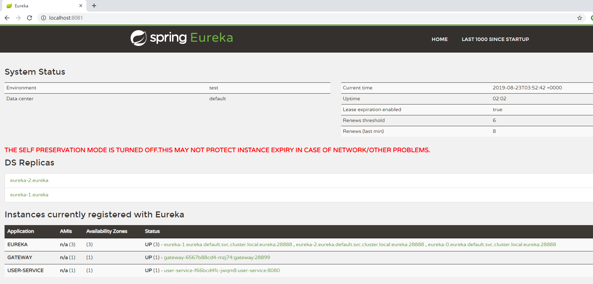

# helm-springcloud-eureka

## Introdução da função

O `springcloud-eureka` pode criar rapidamente um serviço de service discovery [spring cloud oss] (https://spring.io/projects/spring-cloud-netflix), ou seja, [eureka cluster] ( Https://cloud.spring.io/spring-cloud-netflix/multi/multi_spring-cloud-eureka-server.html). O resultado é mostrado abaixo:



## Instalação e uso

### Instalação local
```shell
helm install --name eureka ./eureka/ --set service.type=NodePort /

```

Após a instalação bem-sucedida, você pode ver a seguinte saída:
```shell
NAME:   eureka
LAST DEPLOYED: Sat Aug 31 23:22:06 2019
NAMESPACE: default
STATUS: DEPLOYED
```

### Veja a carga de trabalho implementada:
```shell
# Ver eureka statefulset
> kubectl get sts
NAME     READY   AGE
eureka   1/1     20s
# Ver pod eureka
> kubectl get pod
NAME                           READY   STATUS    RESTARTS   AGE
eureka-0                       1/1     Running   0          110s
```
### Visite a página eureka
```shell
> kubectl port-forward eureka-0 8761:28888

Forwarding from 127.0.0.1:8761 -> 28888
Forwarding from [::1]:8761 -> 28888
Handling connection for 8761
Handling connection for 8761

```

O navegador acessa http://localhost:8761 e o efeito é como mostrado acima